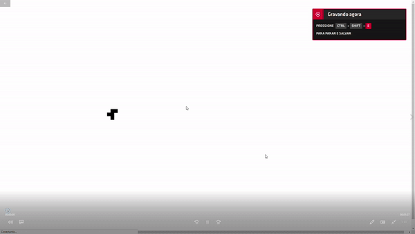

# Game of Life

A implementation of [Conway's Game of Life]([Conway's Game of Life - Wikipedia](https://en.wikipedia.org/wiki/Conway's_Game_of_Life)) with F#

There is a console and a Web project using [Fable]([fable-compiler/Fable: F# to JavaScript Compiler (github.com)](https://github.com/fable-compiler/Fable))

Preview:

